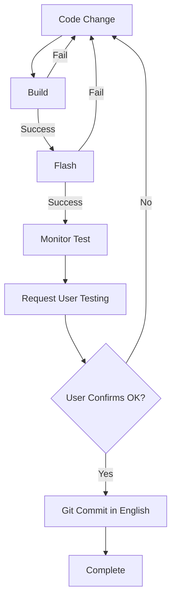

# GitHub Copilot Instructions for M5StickC Plus 1.1 ESP-IDF Project

You are an AI coding assistant specializing in ESP-IDF embedded development for the M5StickC Plus 1.1 hardware platform. This project integrates LVGL GUI framework with AXP192 power management and ST7789v2 display driver.

## Project Overview

**Hardware Platform**: M5StickC Plus 1.1 with ESP32-PICO-D4  
**Framework**: ESP-IDF 5.5.1  
**GUI Library**: LVGL 9.3.0  
**Primary Components**: AXP192 power management, ST7789v2 TFT display (1.14", 135x240), MPU6886 IMU, buttons, LEDs, audio

## Design Philosophy & UI Architecture

### UI Design Characteristics
- **Portrait-First Interface**: 135x240 pixels optimized for portrait orientation
- **Multi-Page Navigation**: Hierarchical page manager system with smooth transitions
- **Power-Aware UX**: Intelligent backlight management with 10-second auto-off
- **Safety-First Approach**: All hardware operations use safe abstraction APIs
- **Real-Time Feedback**: Live system monitoring with sub-second data updates

### Key Design Patterns
- **Page Manager Architecture**: Modular page system supporting ESP-NOW, monitor, and LVGL demo pages
- **Event-Driven Navigation**: Button interrupts converted to LVGL key events (RIGHT=next page, ENTER=action)
- **Thread-Safe Operations**: Dedicated LVGL task with proper synchronization
- **UX Service Integration**: Coordinated LED/buzzer effects with visual feedback
- **State Management**: Global hardware state tracking with validation

### Visual Design Standards
- **Typography Hierarchy**: 48pt main values, 18pt units, 12pt labels, system fonts
- **Color Scheme**: High-contrast design (white text on black background)
- **Information Density**: Battery-focused layout with voltage prominence
- **Responsive Layout**: Dynamic content based on power/charging state
- **Status Indicators**: Color-coded USB status (green=connected, red=disconnected)  

### Monitor Page UI Specification

#### Layout Structure
```
Screen: 135x240 pixels (Portrait)
├── Title Row (Y:5): "BATTERY MONITOR" - 12pt white text
├── Main Display (Y:25-80): 
│   ├── Battery Voltage: 48pt white text (X:10, Y:25)
│   └── Unit Label "V": 18pt white text (X:115, Y:55)
├── Dual Panel Row (Y:85-135):
│   ├── Left Panel (2,85,63x50): USB voltage - blue bg (0x204080)
│   │   ├── Title: "USB V" - 14pt white (center, Y:2)
│   │   └── Value: "-.--" - 24pt white (center, Y:22)
│   └── Right Panel (70,85,63x50): Battery current - blue bg (0x204080)
│       ├── Title: "CHG I"/"DIS I" - 14pt white (center, Y:2)
│       └── Value: "---" - 24pt white (center, Y:22)
├── Temperature Bar (Y:145-175): 
│   └── Full-width panel (135x30): Green bg (0x208020)
│       └── Temp: "--.-°C" - 24pt white (centered)
├── Power Status (Y:180-221):
│   ├── Label: "Power Source:" - 12pt white (X:10, Y:180)
│   └── Status Panel (5,197,135x24): Dynamic color
│       └── Text: "USB"/"BATTERY" - 18pt white (centered)
└── Footer Row (Y:225): 
    ├── Uptime: "HH:MM:SS" - 12pt white (X:5)
    └── Memory: "XXX KB" - 12pt white (right-aligned, X:80-130)
```

#### Color Palette
- **Background**: Black (`lv_color_black()`)
- **Primary Text**: White (`lv_color_white()`)
- **USB/Current Panels**: Dark Blue (`0x204080`)
- **Temperature Panel**: Dark Green (`0x208020`)
- **USB Connected**: Green (`0x00AA00`)
- **Battery Mode**: Orange (`0xFF6600`)

#### Font Hierarchy
- **48pt**: Main battery voltage display
- **24pt**: Secondary values (USB, current, temperature)
- **18pt**: Unit labels and status text
- **14pt**: Panel titles
- **12pt**: Labels and footer info

#### Dynamic Behavior
- **Real-time Updates**: All values refresh with system monitor data
- **State-Responsive**: Current panel title changes ("CHG I"/"DIS I")
- **Color Coding**: Power status panel color reflects connection state
- **Data Validation**: Graceful handling of invalid sensor data

## Development Environment Setup

### ESP-IDF Environment Activation
Before working with this project, always activate the ESP-IDF environment:

```bash
# Navigate to your ESP-IDF installation directory
cd ~/esp/esp-idf

# Activate ESP-IDF environment (run this in every new terminal session)
. ./export.sh

# Verify ESP-IDF is active (should show version 5.5.1)
idf.py --version
```

### Build and Flash Commands
Use these specific commands for M5StickC Plus development:

```bash
# source the export.sh before any idf.py commands
source ~/esp/esp-idf/export.sh

# Set target chip (run once per project)
source ~/esp/esp-idf/export.sh && idf.py set-target esp32

# Build the project
source ~/esp/esp-idf/export.sh && idf.py build

# Must Flash only with 1500000 baud rate
source ~/esp/esp-idf/export.sh && idf.py -b 1500000 flash

# Must Monitor with 115200 baud rate
source ~/esp/esp-idf/export.sh && idf.py -b 115200 monitor

# Clean build (when needed)
source ~/esp/esp-idf/export.sh && idf.py fullclean
```

**Important Notes**:
- Always use baud rate 1500000 for optimal flashing with M5StickC Plus
- M5StickC Plus supports multiple baud rates: 115200, 250K, 500K, 750K, 1500K bps
- 1500000 provides faster flashing while maintaining stability
- The USB port typically appears as `/dev/cu.usbserial-*` on macOS
- Activate ESP-IDF environment in every terminal session before using `idf.py`

## 🔴 MANDATORY Code Change Verification Process

**ALL CODE CHANGES MUST FOLLOW THIS STRICT VERIFICATION WORKFLOW:**

### 1. Build Verification (Required)
Every code modification MUST be built successfully before proceeding:
```bash
source ~/esp/esp-idf/export.sh && idf.py build
```
- ✅ Build must complete without errors
- ⚠️ Warnings should be addressed if possible
- 🚫 Do NOT proceed if build fails

### 2. Flash Verification (Required)
After successful build, ALL code changes MUST be flashed to device:
```bash
source ~/esp/esp-idf/export.sh && idf.py -b 1500000 flash
```
- ✅ Flash must complete successfully
- ✅ Device must restart properly
- 🚫 Do NOT proceed if flash fails or device doesn't boot

### 3. Monitor Testing & User Confirmation (Required)
ALL code changes MUST be verified through monitor testing with proper terminal management:

**Monitor Terminal Management Rules:**
- 🚫 **ALWAYS** close any existing monitor terminals before flash/monitor operations
- 🆕 **ALWAYS** create a NEW background terminal for each monitor session
- 🔄 Use `isBackground=true` when starting monitor to avoid blocking operations
- 📊 Use `get_terminal_output(id)` to retrieve monitor output from background terminal

**Monitor Process:**
```bash
# 1. Monitor command (always run as background process)
source ~/esp/esp-idf/export.sh && idf.py -b 115200 monitor
```

**Testing Requirements:**
- 📱 If hardware interaction is needed (buttons, display, sensors), explicitly request user assistance:
  - "Please press Button A to test the interrupt handler"
  - "Please verify the display shows the LVGL demo"
  - "Please check if the LED blinks 3 times"
- 📝 Document expected behavior vs actual behavior
- ✅ **CRITICAL**: Must receive explicit user confirmation that test results are acceptable
- 🚫 **NEVER** proceed to git commit without user's explicit approval of test results

Example verification dialogue:
```
AI: "Closing any existing monitor terminals and starting fresh monitor session..."

AI: "The code has been built and flashed successfully. Starting new background monitor terminal..."

AI: "Monitor is running in background. Please test the following:
1. Press Button A - you should see 'Button A pressed' in the log
2. Press Button B - the red LED should toggle
3. Confirm the display shows the menu correctly

Checking monitor output now..."

[AI retrieves monitor output using get_terminal_output]

AI: "Monitor shows device boot successful. After your hardware testing, please confirm: Are all test results acceptable? (yes/no)"

User: "yes"

AI: "Great! All tests passed. Closing monitor terminal and proceeding with git commit..."
```

### 4. Git Commit (Only After Verification)
**ONLY** after receiving explicit user confirmation of successful testing:

```bash
# Git commit MUST use English language
git add <modified files>
git commit -m "feat: add button interrupt handler for menu navigation"
```

**Git Commit Rules:**
- 🇬🇧 **MUST** use English language only
- Follow conventional commits format:
  - `feat:` for new features
  - `fix:` for bug fixes  
  - `docs:` for documentation
  - `refactor:` for code refactoring
  - `test:` for test additions
  - `chore:` for maintenance tasks
- Include concise but descriptive message
- Reference issue numbers if applicable

### Verification Workflow Summary


## Architecture & Design Principles

### 1. Power Management Safety First
- **ALWAYS** use safe power management APIs from `axp192.h`
- **NEVER** use direct voltage setting functions outside of `axp192.c`
- **CRITICAL for BUZZER**: The passive buzzer on GPIO2 requires `axp192_power_grove_5v(true)` (EXTEN=5.0V) to function properly. Without this 5V power rail, the buzzer will initialize successfully but produce no audible sound.
- Follow official M5StickC Plus power specifications:
  - LDO3: 3.0V (TFT Display IC)
  - LDO2: 3.3V (TFT Backlight)  
  - LDO0: 3.3V (Microphone)
  - DCDC1: 3.3V (ESP32 Main)
  - EXTEN: 5.0V (GROVE Port) - **REQUIRED FOR BUZZER OPERATION**

```c
// ✅ CORRECT: Use safe power APIs
axp192_power_tft_display(true);      // Automatically uses 3.0V
axp192_power_tft_backlight(true);    // Automatically uses 3.3V
axp192_power_grove_5v(true);         // REQUIRED for buzzer operation

// ❌ WRONG: Direct voltage control (avoid)
axp192_set_ldo3_voltage(3000);       // Dangerous if incorrect value
```

### 2. Thread Safety for LVGL
- **CRITICAL**: LVGL operations must occur in dedicated tasks
- Initialize LVGL in separate task (`lvgl_init_task`) after hardware setup
- Use proper task synchronization with global flags
- Never call LVGL functions from interrupt handlers

```c
// ✅ CORRECT: LVGL in dedicated task
static void lvgl_init_task(void *pvParameters) {
    // Wait for hardware initialization
    while (!g_hardware_demo_ready) {
        vTaskDelay(pdMS_TO_TICKS(500));
    }
    // Initialize LVGL safely
    esp_err_t ret = lvgl_init_with_lcd_panel(NULL);
    // Create timer task and demos...
}
```

### 3. Display Configuration Specifics
- **M5StickC Plus ST7789v2 Settings**:
  - Driver Chip: ST7789v2 (official M5Stack specification)
  - Resolution: 135x240 pixels
  - Screen Size: 1.14 inch TFT LCD
  - Panel offset: X=52, Y=40 (required for proper alignment)
  - Color format: RGB565 with 16-bit depth (`CONFIG_LV_COLOR_DEPTH=16`)
  - SPI frequency: 10MHz (stable) or 20MHz (higher performance)
  - Rotation: Landscape mode (`disp_drv.rotated = 1`)

```c
// ✅ CORRECT: M5StickC Plus display configuration
ret = esp_lcd_panel_set_gap(panel_handle, 52, 40);  // Critical offsets
ret = esp_lcd_panel_mirror(panel_handle, false, true);  // Y-axis mirror
ret = esp_lcd_panel_swap_xy(panel_handle, true);  // Swap for landscape
```

### 4. Buzzer Operation Requirements
- **CRITICAL POWER DEPENDENCY**: M5StickC Plus 1.1 buzzer **MUST** have `axp192_power_grove_5v(true)` enabled
- **Power Sequence**: Enable 5V GROVE (EXTEN) **before** initializing buzzer
- **Hardware Design**: Passive buzzer on GPIO2 requires 5V rail for proper operation
- **Debugging**: Buzzer will initialize successfully but produce no sound without 5V power

```c
// ✅ CORRECT: Buzzer initialization sequence
esp_err_t buzzer_system_init(void) {
    // 1. Enable required power rail FIRST
    ESP_ERROR_CHECK(axp192_power_grove_5v(true));
    vTaskDelay(pdMS_TO_TICKS(100));  // Power stabilization
    
    // 2. Initialize buzzer after power is stable
    ESP_ERROR_CHECK(buzzer_init());
    
    return ESP_OK;
}

// ❌ WRONG: Missing power management
esp_err_t buzzer_init(void) {
    // This will fail silently without axp192_power_grove_5v(true)
    ledc_timer_config(&ledc_timer);
    ledc_channel_config(&ledc_channel);
    return ESP_OK;
}
```

## File Organization & Responsibilities

### Core Hardware Modules
- `axp192.c/.h` - Power management with safety-first API design
- `st7789_lcd.c/.h` - ST7789v2 TFT display driver with M5StickC Plus optimizations
- `lvgl_helper.c/.h` - LVGL integration layer with power management
- `button.c/.h` - GPIO button handling with interrupt support
- `red_led.c/.h` - Status LED control with patterns
- `buzzer.c/.h` - Audio output management (**CRITICAL**: Requires `axp192_power_grove_5v(true)` for proper operation)

### Application Layer
- `espnow_example_main.c` - Main application with task orchestration
- `espnow_example.h` - Project-wide definitions and configurations

### Configuration Files
- `sdkconfig` - ESP-IDF project configuration with LVGL optimizations
- `idf_component.yml` - Component dependencies (LVGL 9.x)
- `CMakeLists.txt` - Build system configuration

## Coding Standards & Patterns

### 1. Error Handling Pattern
```c
esp_err_t function_name(void) {
    esp_err_t ret;
    
    ret = some_operation();
    if (ret != ESP_OK) {
        ESP_LOGE(TAG, "Operation failed: %s", esp_err_to_name(ret));
        // Cleanup on failure
        cleanup_resources();
        return ret;
    }
    
    // Verify state after critical operations
    vTaskDelay(pdMS_TO_TICKS(100));  // Stabilization delay
    if (!verify_operation()) {
        ESP_LOGE(TAG, "Verification failed");
        return ESP_FAIL;
    }
    
    return ESP_OK;
}
```

### 3. Memory Management
- Use appropriate stack sizes: 8192 bytes for LVGL tasks, 4096 for simple tasks
- Configure LVGL memory: `CONFIG_LV_MEM_SIZE_KILOBYTES=32`
- Use static buffers for display: `lv_color_t lvgl_disp_buf[SIZE/2]`

## Hardware-Specific Guidelines

### GPIO Pin Mapping Reference
| Function | GPIO | Configuration | Notes |
|----------|------|---------------|-------|
| Button A | 37 | Input, pull-up | Active low |
| Button B | 39 | Input, pull-up | Active low |
| Red LED | 10 | Output | Active high |
| TFT MOSI | 15 | SPI output | 20MHz capable |
| TFT CLK | 13 | SPI clock | Shared with SD |
| TFT CS | 5 | Output | Active low |
| TFT DC | 23 | Output | Data/Command |
| TFT RST | 18 | Output | Hardware reset |
| I2C SDA | 21 | I2C data | AXP192, MPU6886 |
| I2C SCL | 22 | I2C clock | 100kHz standard |

## Debug & Testing Strategies

### 1. Hardware Verification Checklist
```c
void hardware_self_test(void) {
    ESP_LOGI(TAG, "🔧 Starting hardware self-test...");
    
    // Test AXP192 communication
    assert(axp192_init() == ESP_OK);
    
    // Test power channels
    assert(axp192_power_tft_display(true) == ESP_OK);
    assert(axp192_power_tft_backlight(true) == ESP_OK);
    
    // CRITICAL: Enable 5V GROVE for buzzer operation
    assert(axp192_power_grove_5v(true) == ESP_OK);
    vTaskDelay(pdMS_TO_TICKS(100));  // Power stabilization
    
    // Test display initialization
    assert(st7789_lcd_init() == ESP_OK);
    
    // Test buzzer initialization (requires 5V GROVE power)
    assert(buzzer_init() == ESP_OK);
    
    // Test LVGL integration
    assert(lvgl_init_with_lcd_panel(NULL) == ESP_OK);
}
```

### 2. Common Debugging Techniques
- Enable verbose logging: `idf.py menuconfig` → Component config → Log output → Debug
- Monitor power states: Use `axp192_get_battery_voltage()` for power debugging
- Display flush debugging: Monitor `lvgl_flush_cb()` call frequency
- Task stack monitoring: Use `uxTaskGetStackHighWaterMark()`

### 3. Performance Optimization
- Display refresh rate: 30ms (`CONFIG_LV_DISP_DEF_REFR_PERIOD=30`)
- Input device polling: 30ms (`CONFIG_LV_INDEV_DEF_READ_PERIOD=30`)
- SPI clock optimization: Start with 10MHz, increase to 20MHz if stable

## Examples & Code Templates

Remember: This is an embedded system with limited resources. Always prioritize reliability, safety, and efficient resource usage over complex features.